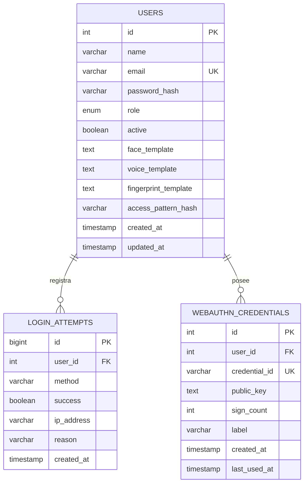

# Diagrama actual del proyecto

## Estructura de archivos
├── vendor/                       # Dependencias instaladas por Composer
                              users / login_attempts / webauthn_credentials
├── composer.json

```text
auth_php_academico-1/
├── admin/
│   └── users.php                 # Administración de usuarios
├── config/
│   └── config.php                # Sesión, PDO, CSRF y utilidades comunes
├── docs/
│   └── diagrama.md
├── public/
│   ├── assets/
│   │   ├── landing.css
│   │   └── style.css
│   ├── biometric.php             # Interfaz para rostro, voz y WebAuthn
│   ├── biometric_delete.php      # Elimina registros biométricos propios
│   ├── biometric_very.php        # Registra/verifica plantillas de rostro y voz
│   ├── dashboard.php             # Panel de usuario y gestión de biometría
│   ├── index.php                 # Selección del método de acceso
│   ├── login.php                 # Acceso por patrón
│   ├── logout.php
│   ├── webauthn_options.php      # Opciones/challenge de registro o acceso
│   └── webauthn_verify.php       # Verificación criptográfica WebAuthn
├── vendor/                       # Dependencias instaladas por Composer
                              users / login_attempts / webauthn_credentials
├── composer.json
├── composer.lock
├── database.sql
├── README.md
└── setup.php                     # Crea BD, tablas y usuario de demostración
```

## Flujo principal

```text
index.php
├── Patrón ───────────────> login.php ──────────────┐
├── Rostro / voz ─────────> biometric.php            │
│                            └─ biometric_very.php ──┤
└── Huella / passkey ─────> biometric.php            │
                             ├─ webauthn_options.php │
                             └─ webauthn_verify.php ──┤
                                                     v
                                          users / login_attempts
                                                     │
                                                     v
                                                dashboard.php
                                                     │
                    ┌────────────────────────────────┼────────────┐
                    v                                v            v
             biometric_delete.php             admin/users.php  logout.php
```

El archivo de administración está físicamente en `admin/users.php`, fuera de `public/`. Sin embargo, el enlace que aparece en `public/dashboard.php` apunta a `public/admin/users.php`; esa ruta no corresponde al árbol actual.

## Modelo de datos



`login_attempts.user_id` puede quedar en `NULL` cuando se elimina un usuario (`ON DELETE SET NULL`). Las credenciales de WebAuthn se eliminan junto con su usuario (`ON DELETE CASCADE`). El acceso por huella/passkey guarda las credenciales y claves públicas en `webauthn_credentials`; `users.fingerprint_template` existe en el esquema, pero no es el almacenamiento usado por ese flujo.